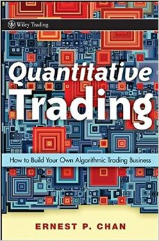

This is my notes on the book *[Quantitative Trading: How to Build Your Own Algorithmic Trading Business](https://www.amazon.com/Quantitative-Trading-Build-Algorithmic-Business/dp/0470284889/ref=sr_1_1?ie=UTF8&qid=1493239940&sr=8-1&keywords=quant+trading+ernie+chan)* by Dr. Ernie Chan. 

Most importantly, I am trying to use `python` to re-write all his `matlab` codes. If necessary, I will change my implementation.  

# Notes List

- [Chapter 1](Chapter_1.ipynb)
- [Chapter 2](Chapter_2.ipynb)
- [Chapter 3](Chapter_3.ipynb)
- [Chapter 4](Chapter_4.ipynb)
- [Chapter 5](Chapter_5.ipynb)
- [Chapter 6](Chapter_6.ipynb)
- [Chapter 7](Chapter_7.ipynb)
- [Chapter 8](Chapter_8.ipynb)

# References

- My Jupyter Notebook Style is adapted from [AeroPython](https://github.com/barbagroup/AeroPython)